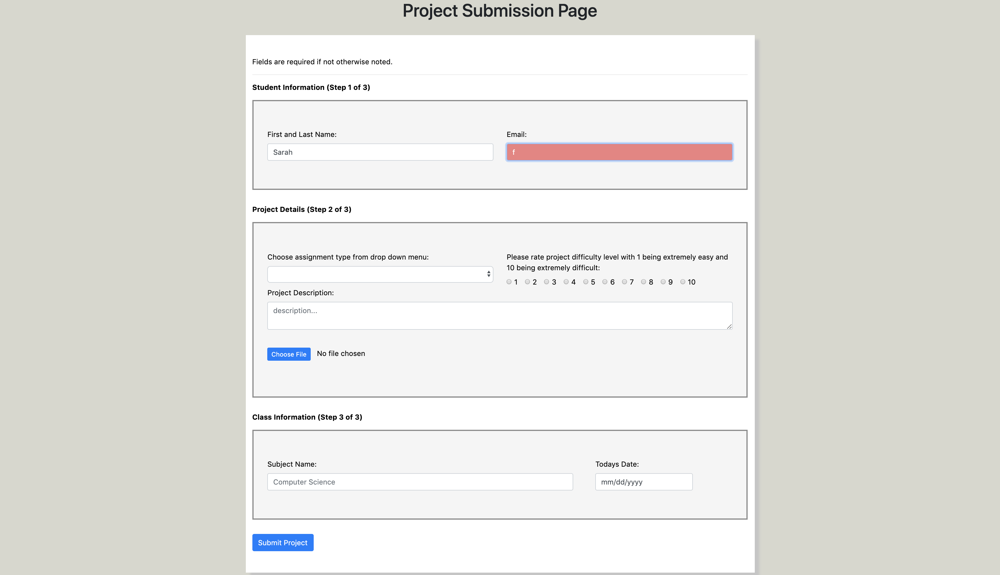
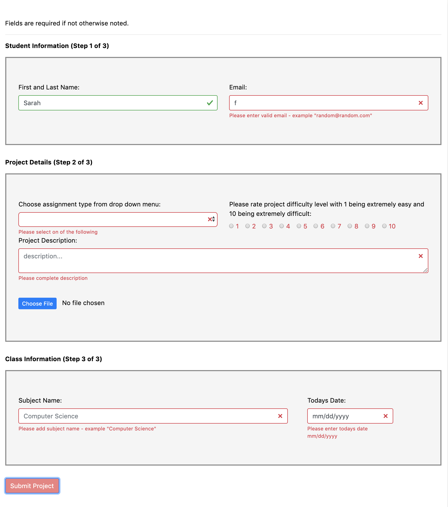
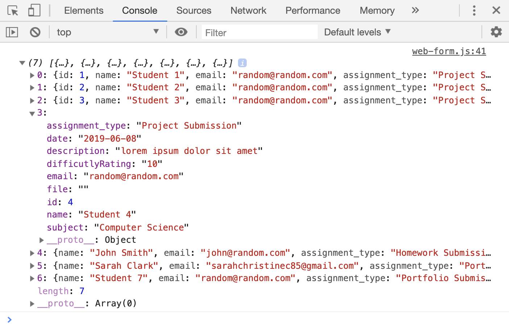

# W3C-Web-Form

## About
This is a responsive web form for users to submit a project and additional information in the required input fields.  When the form is submitted it 'posts' the users inputs in the body, and API responses are displayed in the console. The form is WCAG 2.1 accessible.
* Heroku for site deployment.  Click to check out demo [here](https://nameless-meadow-25599.herokuapp.com/). (Need to install app to see console details).

## Install
```
git clone
npm install
npm run json:server
```

## Technologies used
HTML, CSS, JavaScript, Bootstrap, JSON Placeholder / rest API for web submissions.

## Preview



Refresh main page to get updated inputs in console.


